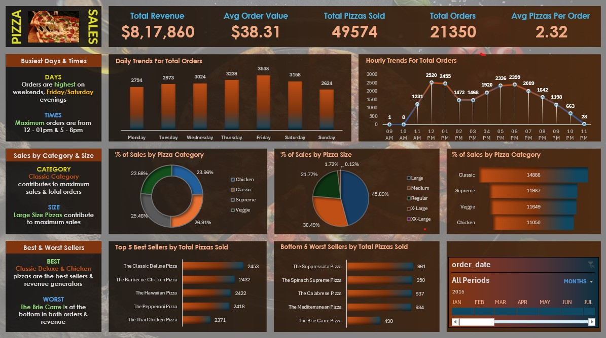

# 🍕 Pizza Sales Data Analysis Project

This project focuses on analyzing pizza sales data using **MS SQL Server** for querying and **Microsoft Excel** for data visualization. It explores sales trends, best and worst selling pizzas, time-based performance, and category insights.

---

## 📌 Objectives

- Extract key KPIs from raw sales data using SQL
- Build visual dashboards in Excel
- Identify top and bottom performing products
- Analyze trends by day, hour, category, and size
- Verify Excel visuals by cross-checking SQL query outputs

---

## 🛠️ Tools & Technologies

- Microsoft SQL Server
- Microsoft Excel
- Pivot Tables, Charts, Conditional Formatting

---

## 🔍 Key Metrics Extracted

- Total Revenue
- Average Order Value
- Total Pizzas Sold
- Average Pizzas Per Order
- Daily & Hourly Order Trends
- Sales by Pizza Category and Size
- Top 5 and Bottom 5 Selling Pizzas

---

## 📸 Dashboard Preview

---

## 💡 SQL Query Samples

All queries used in this analysis — including KPI generation, sales breakdown, and trend analysis — are documented in the PDF below. A few screenshots of query outputs are also included.

👉 [📄 View Full SQL Queries PDF](My%20PIZZA%20SALES%20QUERIES.pdf)

---

## ✅ Data Verification

Every visualization created in Excel was verified using the raw SQL output to ensure data integrity and accuracy.

---

## 📁 Project Structure

